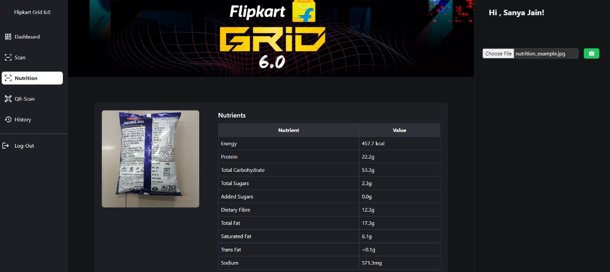

` `**Smart Vision Quality Control System**

**Project Overview**

**Smart Vision Quality Control System** is an advanced quality control solution, leveraging state-of-the-art **image processing** and **machine learning** technologies. This application enhances accuracy in detecting product attributes like text (MRP, expiry dates), object classification, and freshness, barcode, nutrition and ingredients providing real-time results for grocery and perishable items.

The system integrates a React-based web interface (deployed on **Netlify**) with a Flask/FastAPI backend powered by a fine-tuned **LLM (Gemini)** for predictions. All processed data is dynamically stored in MongoDB databases for future reference.

![ref1]

🚀 **Web application link: [https://flipkrt-grid-mars.netlify.app/**](https://flipkrt-grid-mars.netlify.app/)**

**🚀 Backend repository link: [https://github.com/PiyushM001/flipkart-grid-backend**](https://github.com/PiyushM001/flipkart-grid-backend)**

**🚀** **Practical Usage Link: [Video Link**](https://drive.google.com/file/d/1RyE0Gsdrise3Rw0hRBiOBsdiI9FCeukP/view)**

![ref1]

**✨ Features**

- **Brand and Product Name**: Accurately identifies brand and product name with multilingual support.
- **Text Recognition (OCR)**: Extracts text like MRP and expiry dates with high precision.
- **Freshness & Quality Assessment**: AI-based freshness detection for fruits and vegetables.
- **Dynamic Results Display**: Results are displayed in tables with detailed product insights.
- **History Tracking**: Store and view historical scan data for both groceries and perishable items.
- **Responsive UI/UX**: Built with **React.js** and styled using **Tailwind CSS**.
- **Staff Login**: Secure staff authentication for accessing the application.
- **Dashboard**: Displays:
   - Total products and fruits processed daily.
   - Charts for products processed, fruits processed, and spoiled items over time.
   - Count of spoiled fruits, vegetables, and eggs.
   - Donut charts visualizing the distribution of processed categories (e.g., dairy, snacks, fruits, and vegetables).
- **Barcode Decoding**: Decodes barcodes from uploaded images.
- **Nutritional Analysis and Ingredients** : Displays nutrient contents and ingredients  of a product upon image upload.

![ref1]

**Tech Stack**

**Frontend**

- **React.js**: Component-based architecture.
- **Tailwind CSS**: Modern utility-first CSS for clean UI design.
- **Axios**: HTTP client for API communication.
- **Netlify**: Deployment platform for the frontend application.

**Backend**

- **Flask/FastAPI**: Lightweight backend for processing API requests.
- **Fine-Tuned LLM (Gemini)**: For object classification and text detection.
- **MongoDB**: Database to store product and fruit/vegetable history.
- **Node**.JS : backend 
- **Express.js**: Middleware for backend APIs.

![ref1]

**System Workflow**

1. **User Interaction**:

   Users interact with a React-based UI to:

- Log in through the secure staff login page.
  1. Access the dashboard, scan page, barcode decoding, nutritional analysis, and history
1. **Prediction Request**:
   1. The uploaded image is sent to the backend using **Axios POST requests**.
   1. **app.py** processes the image using a fine-tuned **Gemini LLM** for: 
      1. Object Detection
      1. Text Recognition (MRP, expiry date, quantity)
      1. Classification into **Grocery** or **Fruits/Vegetables**
1. **Response Handling**:
   1. The backend sends a **JSON response** with product details.
   1. If the image contains: 
      1. **Grocery Items**: Data is sent to the grocery database.
      1. **Fruits/Vegetables**: Data is sent to a separate fruits/vegetables database.
1. **Dynamic UI Update**:
   1. The result is dynamically added to arrays savedResults / savedResults2 and displayed in the UI.
   1. A **History** button retrieves all previously scanned products from the respective databases.

![ref1]

**Frontend**

**React Components and Flow**

**1. Login and Dashboard:**

1. **Staff Login:** The first page ensures authentication for staff members.
1. **Dashboard:**

   **Displays key metrics Dynamically:**

- Total items processed.
- Fruits and products processed today.
- Spoiled fruits/vegetables count.
- Includes charts for trends in processed items and spoilage over time.

A pie chart categorizes processed items (e.g., Dairy, Snacks, Fruits/Vegetables).

**2. Scan Page:**

`         `**Allows users to:**

1. Upload an image from their local machine.
1. Capture an image directly.

1. Displays results dynamically in a table format based on the uploaded image.

**3. Nutritional Analysis:**

1. Users can upload an image of a packaged product.
1. The model outputs:
   1. Nutritional Content Table: Lists key nutrients and their quantities

1. Ingredients Table: Extracts and displays ingredients, if available in the image

**4. Barcode Scanning:**

1. Users upload an image containing a barcode.
1. The system decodes the barcode and displays the result in real time.

**5. History Page:**

`        `**Displays separate tables for:**

1. Packaged Products: Details such as brand, MRP, expiry date, etc.

1. Fruits/Vegetables: Freshness index, expected lifespan, and timestamp.

**Backend**

1. **Prediction API** (POST /predict):
   
- **Fine-Tuned LLM for Prediction**:

  The model leverages a fine-tuned **Gemini LLM** with advanced prompt engineering to extract specific details such as:

  - **Product Details**: Brand names, MRP, expiry dates, and product names.
    
   - **Freshness & Expected Life Span**: For fruits/vegetables, the model estimates a **freshness index** (scale of 1-10) and calculates the expected life span on basis of how much it is suitable to eat.

   - **Count**: Model also finds the count of each distinct item present in the given image.

- **Classification of Image Content**:

     The LLM first classifies the image into **packaged items** or **fruits/vegetables** based on visual and contextual analysis, avoiding misinterpretation of packaging images.

- **Packaged Item Analysis**:

   - For packaged items, the model extracts product details like **MRP**, **brand**, **expiry date**, using the OCR text recognition method then calculates if the product is expired or not.

   - It also adds a **timestamp** and organizes the data into a structured JSON format.

- **Fruits/Vegetables Analysis**:

   - For fruits and vegetables, the model predicts names, **freshness index**, **expected life span** and **description** of the given fruit/vegetable.** 

   - The model outputs a freshness index on a scale of 1 to 10, where:

      - **9-10**: Fully fresh produce with vibrant colour, smooth texture, and no visible blemishes.

      - **4–8**: Moderately fresh, possibly showing slight discoloration or minor surface irregularities.

      - **1–3**: Spoiled or decayed, with prominent black spots, shriveling, discoloration, or structural deformities.
   - The model determines freshness index and life span on basis of color,texture,shape and firmness,wether spot blemish present,extent of moisture and shriveling.

   - It dynamically parses the details into JSON, ensuring each entry includes a **timestamp** for tracking history.

- **Nutritional Analysis and Ingredients:**

   - **API Call**: User uploads an image via /predict.

   - **Image Upload**: Image is saved and sent to Google GenAI's

  ` `Gemini model.

   - **Analysis**: Model extracts nutrients (key-value pairs) and ingredients (list) from the image.

   - **Parsing & Formatting**: 

      - The parsed response is converted into two separate Data Frames ,nutrients and ingredients.

      - These Data Frames are merged into a single structure for easier handling.

   - **Response**: API returns a JSON object with:

      - Filename

      - Message: Success or error status

      - **Product Details:** A list of records containing the nutrient and ingredient data.

- **Barcode Decoding:**

   - **API Call**: User uploads an image via the /decode endpoint.

   - **Image Processing**:

      - Image is read and analysed using a pre-trained YOLO-v8 model (barcode.pt) to detect barcode regions.
      - For each detected region, the system applies rotation (0° to 360° in 30° intervals) to handle orientation issues.

   - **Barcode Decoding**:

      - Decoded barcodes are extracted using pyzbar from rotated and pre-processed images (e.g., grayscale and thresholding).

   - **Response**:

      - If barcodes are decoded, a JSON response with the decoded data and barcode type is returned

      - If no barcode is found, a message indicating failure is sent.

- **API Workflow:**

   - **Request Handling**: The API accepts image files via HTTP POST requests, processes them using Gemini LLM, and returns predictions.

   - **Response**: Depending on classification (grocery vs. fruits/vegetables), the processed results are returned as JSON, ready for display and database storage.

2. **Database Storage**

- **Schema Design**: 
  1. Two Mongoose schemas are defined: 
     1. productSchema for packaged product details (e.g., product name, brand, MRP, expiry date).
     2. fruitSchema for fruits/vegetables with fields like freshness\_index and expected\_life\_span.
- **Data Storage**: 
  1. The data is stored in MongoDB Atlas using Product and Fruit collections when endpoints /add-product and /add-fruit are called.
  2. Data persistence ensures records are saved for future access.

![ref1]

1. **History Retrieval**

- **Endpoints**: 
  1. /products-history: Fetches all stored packaged product records from MongoDB.
  1. /fruits-history: Retrieves all stored fruit/vegetable data, including freshness index and lifespan.
- **Response Format**: 
  1. Returns data in JSON format for easy integration with front-end applications or further analysis.
  1. Error handling ensures smooth retrieval, even if the database operation fails.

[ref1]: Aspose.Words.db60b9e8-4f20-4709-922c-1d5acfddc531.001.png